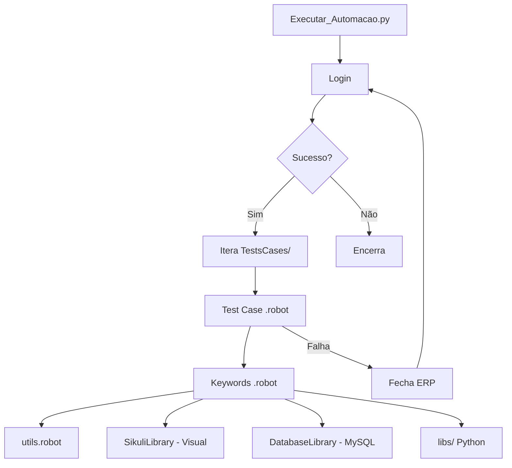
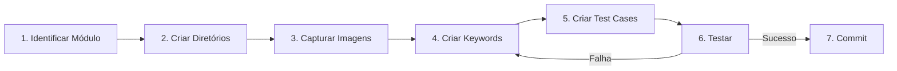

# Skill: Padrões de Desenvolvimento

## Objetivo

Documentar como o desenvolvimento é feito neste projeto, servindo como guia para qualquer pessoa (ou agente IA) que precise criar ou modificar testes.

## Quando Usar

- Quando o usuário perguntar **"como desenvolver aqui?"**
- Quando precisar entender a **arquitetura** e **padrões** do projeto
- Antes de criar qualquer código novo

---

## Arquitetura do Projeto



### Fluxo de Desenvolvimento



---

## Passo a Passo de Desenvolvimento

### Passo 1 — Identificar o Módulo do ERP

Determine qual funcionalidade do myCommerce será testada:
- **Comercial**: Vendas, Condicional, Devolução, Doação, Orçamento, Ordem de Serviço
- **Financeiro**: Caixa, Contas a Pagar, Contas a Receber
- **Emissão**: Notas Fiscais, Ordem de Entrega
- **Faturamento**: Faturamento de vendas
- **Pré-Venda**: Pedidos

### Passo 2 — Criar Estrutura de Diretórios (se necessário)

Se o módulo ainda não existe, criar diretórios espelhados:

```
Testes_BancoAleatorio/
├── KeyWords/<Módulo>/<SubMódulo>/
└── TestsCases/<Módulo>/<SubMódulo>/
```

**Exemplo** para um novo módulo "Cadastro de Clientes":
```
KeyWords/Cadastro/Clientes/
TestsCases/Cadastro/Clientes/
```

### Passo 3 — Capturar Imagens

Antes de automatizar, é necessário capturar screenshots dos elementos visuais do ERP:

1. Abrir o myCommerce no módulo a ser testado
2. Capturar (Print Screen + recorte) cada elemento:
   - **Telas**: `tela_NomeDaTela.png` — a tela/janela completa ou título
   - **Botões**: `btn_NomeDoBotao.png` — botões que serão clicados
   - **Inputs**: `input_NomeDoInput.png` — campos de entrada
   - **Modais**: `modal_NomeDoModal.png` — janelas modais/popups
   - **Avisos**: `aviso_NomeDoAviso.png` — mensagens de aviso
   - **Labels**: `lb_NomeDoLabel.png` — labels para validação visual
   - **Rows**: `row_NomeDaRow.png` — linhas em grids/tabelas
3. Salvar em `Testes_BancoAleatorio/images/`
4. As imagens devem ser **o menor recorte possível** que identifique o elemento unicamente

### Passo 4 — Criar Arquivo de Keywords

Criar `KeyWords/<Módulo>/<SubMódulo>/Key<Nome><N>.robot`:

```robot
*** Settings ***
Library    SikuliLibrary
Library    ImageHorizonLibrary 
Library    DatabaseLibrary
Library    ../../../libs/validaParametros.py
Library    Process
Library    Telnet
Variables    ../../../libs/leituraConfig.py

Resource    ../../../utils/validacaoAviso.robot
Resource    ../../../utils/utils.robot

*** Variables ***
# Repositório de Imagens
${IMAGENS}                    ./Testes_BancoAleatorio/images

# Conexão com o Banco de Dados
${DBHost}                     ${config.IpServidor}
${DBName}                     ${config.Database}
${DBPass}                     vssql
${DBPort}                     ${config.Porta}
${DBUser}                     root

# Sleep's
${SLEEP_BAIXO}                0.7
${SLEEP_MEDIO}                1.5
${SLEEP_ALTO}                 3
${TEMPO_TELA}                 25

# Telas (imagens .png)
${TELA_EXEMPLO}               tela_Exemplo.png

*** Keywords ***
Ler imagens iniciais
    Add Image Path    ${IMAGENS}

Dado que acesso a tela de <módulo>
    Press Special Key    <ATALHO>
    Wait Until Screen Contain    ${TELA_EXEMPLO}    ${TEMPO_TELA}

E adiciono um novo <item>
    Sleep    ${SLEEP_BAIXO}
    Press Combination    KEY.ALT    KEY.A
    Wait Until Screen Contain    ${TELA_ADICIONAR}    ${TEMPO_TELA}

Quando insiro vendedor e cliente
    utils.Adicionar Vendedor e Cliente(<TelaNome>)
    validacaoAviso.Verifica avisos presentes ao incluir cliente(${Codigo_Cliente})

Então finalizo o <item>
    Press Combination    KEY.ALT    KEY.F
    Wait Until Screen Contain    ${TELA_PRINCIPAL}    ${TEMPO_TELA}
```

#### Padrões Importantes nas Keywords

1. **BDD em Português**: `Dado que`, `Quando`, `Então`, `E`
2. **Argumentos embutidos no nome**: `Quando insiro um produto normal informando a quantidade(${Quantidade_Produto})`
3. **Namespacing**: Usar `NomeArquivo.NomeKeyword` quando houver ambiguidade
4. **Sleep antes de ações**: Sempre incluir `Sleep    ${SLEEP_BAIXO}` antes de combinações de tecla
5. **Wait após ações**: Sempre usar `Wait Until Screen Contain` após navegar para outra tela
6. **Queries SQL para validação**: Usar `Query` para obter dados e `Check If Exists/Not Exists` para validar

### Passo 5 — Criar Arquivo de Test Cases

Criar `TestsCases/<Módulo>/<SubMódulo>/Teste_<Nome><N>.robot`:

```robot
*** Settings ***
Documentation    <Descrição dos testes>

Resource    ../../../KeyWords/<Módulo>/<SubMódulo>/Key<Nome><N>.robot
Resource    ../../../utils/parametros_pre_condicoes.robot

Suite Setup    Run Keywords
...    Start Sikuli Process
...    AND    Key<Nome><N>.Ler imagens iniciais
...    AND    Conectar ao Banco de Dados
...    AND    Preparar Ambiente MyCommerce
Suite Teardown    Stop Remote Server

*** Test Cases ***
Teste 01 - <Descrição do teste>
    [Tags]    Teste01

    Dado que acesso a tela de <módulo>
    E adiciono um novo <item>
    Quando insiro vendedor e cliente
    Key<Nome><N>.Quando insiro um produto normal informando a quantidade(1)
    Então finalizo o <item>
    E saio da tela(<TelaNome>)

Teste 02 - <Outra descrição>
    [Tags]    Teste02

    Dado que acesso a tela de <módulo>
    # ... passos do teste
```

#### Padrões Importantes nos Test Cases

1. **Sem implementação direta**: Test Cases apenas chamam Keywords
2. **Tags sequenciais**: `[Tags]    Teste01`, `Teste02`, etc.
3. **Suite Setup padrão**: Start Sikuli → Ler imagens → Conectar BD → Preparar ambiente
4. **Suite Teardown padrão**: `Stop Remote Server`
5. **Imports**: Usar `Resource` para importar Keywords e utils

### Passo 6 — Testar

```bash
# Executar todos os testes do arquivo
robot -d .\\results\\ .\\TestsCases\\<Módulo>\\<SubMódulo>\\Teste_<Nome>.robot

# Executar teste específico por tag
robot -d .\\results\\ -i Teste01 .\\TestsCases\\<Módulo>\\<SubMódulo>\\Teste_<Nome>.robot
```

> ⚠️ **IMPORTANTE**: Clicar na tela após pressionar ENTER ou o teste falhará (o myCommerce precisa de foco na janela).

---

## Padrões Avançados

### Montador de Cenários

Para testes que dependem de pré-condições complexas (ex: testar devolução requer ter uma venda feita primeiro), usar o `montadorDeCenarios.robot`:

```robot
Resource    ../../../utils/montadorDeCenarios.robot

*** Test Cases ***
Teste 01 - Devolução após venda
    [Tags]    Teste01

    Dado que realizo uma venda completa, com produto normal
    # Agora posso testar a devolução
    Dado que acesso a tela de devoluções
    # ...
```

### Integração com Python (`libs/`)

Quando a lógica é complexa demais para Robot Framework, criar uma classe Python em `libs/`:

```python
# libs/minhaValidacao.py
import mysql.connector
import leituraConfig as config

class minhaValidacao:
    def validar_algo(self, parametro):
        # Lógica complexa em Python
        return resultado
```

Importar no Robot:
```robot
Library    ../../../libs/minhaValidacao.py
```

### Tratamento de Avisos do ERP

O myCommerce exibe diversos avisos/popups durante operações. Usar `validacaoAviso.robot`:

```robot
validacaoAviso.Verifica avisos presentes ao incluir cliente(${Codigo_Cliente})
```

### Validação de Parâmetros

Antes de executar testes, validar configurações do ERP:

```robot
Resource    ../../../utils/parametros_pre_condicoes.robot

Suite Setup    Run Keywords
...    AND    Preparar Ambiente MyCommerce  # Valida e ajusta parâmetros
```

---

## Checklist de Novo Desenvolvimento

- [ ] Módulo do ERP identificado
- [ ] Diretórios espelhados criados em `KeyWords/` e `TestsCases/`
- [ ] Imagens capturadas e salvas em `images/`
- [ ] Variáveis de imagem definidas com prefixo correto (`${TELA_}`, `${AVISO_}`, etc.)
- [ ] Keywords criadas com BDD em português
- [ ] Test Cases criados com Tags sequenciais
- [ ] Suite Setup e Teardown configurados
- [ ] Conexão com BD configurada
- [ ] Teste executado e validado localmente
